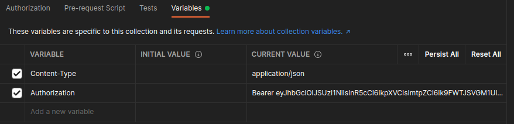
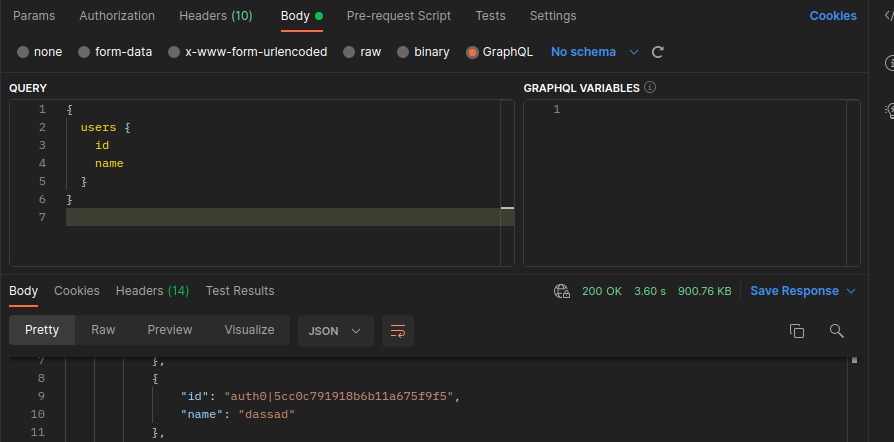

# Class13 - Sample book with REST API and GRAPH API

* OFFICIAL REPO
[https://github.com/panacloud-modern-global-apps/api-design-prototype-testing](https://github.com/panacloud-modern-global-apps/api-design-prototype-testing)

* [Video Link](https://www.youtube.com/watch?v=VywxIQ2ZXw4)
* API Link [https://simple-books-api.glitch.me](https://simple-books-api.glitch.me)
* Select on URL and set as variable "baseUrl"
    * you can also check with edit collection option ...
### {{baseUrl}}/books
* Optional parameters
    * type
    * limit
### {{baseUrl}}/books/1
    * /books/:bookId
        * prams tab -> path variable

### POST /api-clients/

The request body needs to be in JSON format and include the following properties:

* clientName - String
* clientEmail - String

Example
```
{
   "clientName": "Valentin",
   "clientEmail": "valentin@example.com"
}
```

The response body will contain the access token.   
* set "accessToken" variable in collection edit option then save it.
### /orders/
* Authorization -> Type -> bearer token->{{accessToken}}

____
# GraphQL with POST MAN
[Official Repo link](https://github.com/panacloud-modern-global-apps/api-design-prototype-testing/tree/main/step01_testing_graphql_api_with_postman)
1. Login or Signup [https://hasura.io/learn/graphql/graphiql](https://hasura.io/learn/graphql/graphiql) 
2. Create new collection
    * select variable tab
        * add 
        
    * create new request
        * select header tab and new key values
        
        * select body tab -> graphql
        

```
GraphQL Public APIs:
1. GitHub
https://developer.github.com/v4/explo...

2. OneGraph GraphiQL
https://www.onegraph.com/graphiql

3. The Original: SWAPI
https://graphql.org/swapi-graphql
API URL : https://swapi-graphql.netlify.app/.ne...

4. SpaceX
https://api.spacex.land/graphql/

5. Rick and Morty
https://rickandmortyapi.com/graphql

6. hasura 
https://hasura.io/learn/graphql/graphiql
```